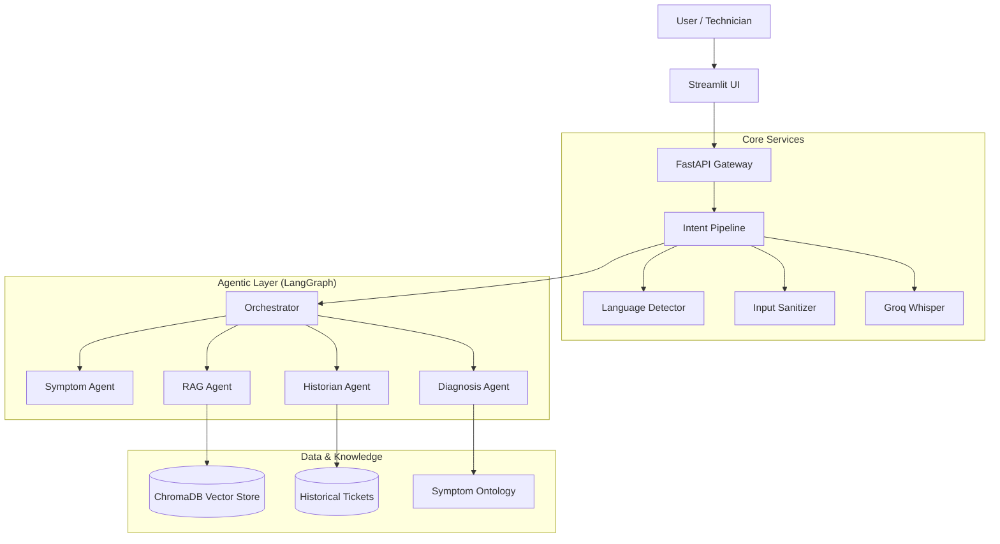
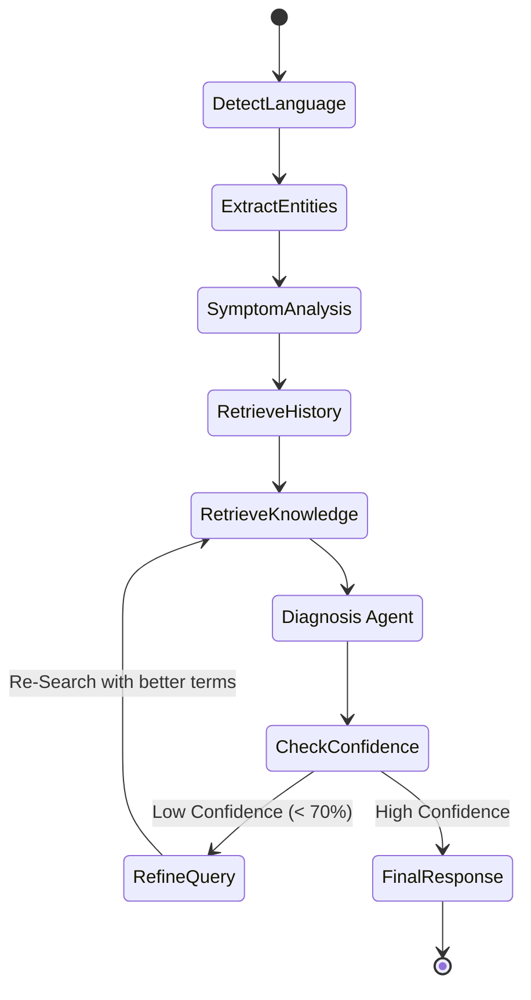

# GarageIQ Architecture 🏗️

## 1. High-Level Design (HLD)

The system is designed as a **Microservices-ready, Event-Driven Architecture** built on Python and LangGraph. It is containerized using Docker and exposes a RESTful API via FastAPI.



---

## 2. Agentic Workflow (Reflexion Loop)

The core intelligence is powered by a **Cyclic Graph** that allows the system to self-correct when confidence is low.



---

## 3. Technology Stack

| Layer | Technology | Purpose |
|-------|------------|---------|
| **Frontend** | Streamlit | Rapid prototyping of Voice/Chat UI |
| **Backend** | FastAPI | High-performance async API |
| **Orchestration** | LangGraph | State management for agents |
| **Inference (Fast)** | Groq (Llama-3) | Sub-second (~0.2s) inference |
| **Vector DB** | ChromaDB | Semantic search for RAG |
| **Observability** | Prometheus | Metric tracking |
| **Container** | Docker | Reproducible deployment |

---

## 4. Key Components

### 4.1. The Pipeline
The `IntentPipeline` class serves as the main entry point. It handles:
- **Warmup**: Pre-loads models on startup (see `warmup.py`).
- **Sanitization**: Removes prompt injection attacks (see `sanitizer.py`).
- **Telemetry**: Tracks latency and success rates.

### 4.2. RAG (Retrieval Augmented Generation)
We use a **Hybrid Search** approach:
1.  **Keyword Match**: Matches specific DTC codes (e.g., "P0300").
2.  **Semantic Match**: Uses `sentence-transformers` to find conceptually similar symptoms (e.g., "loud bang" ≈ "backfire").

### 4.3. Multi-Lingual Support
The system natively supports Hindi and Hinglish without a translation layer for inference. It uses multilingual embeddings (`paraphrase-multilingual-MiniLM-L12-v2`) to map Hindi symptoms to English technical concepts.

---

## 5. Advanced Features (Domain-Specific)

### 5.1. Noisy Input Normalization
**Problem**: Service advisors use abbreviations like "cus sts frt lft noise".
**Solution**: `normalizer.py` with 100+ automotive abbreviations and typo patterns.
```
Input:  "Cus sts thumping noise frt left"
Output: "customer states thumping noise front left"
```

### 5.2. VIN/Registration Decoder
**Problem**: Need to filter RAG results by vehicle variant.
**Solution**: `vin_decoder.py` decodes 17-char VINs and Indian registrations (MH12AB1234).

### 5.3. TSB Override (Knowledge Hierarchy)
**Problem**: Old manuals override newer TSBs.
**Solution**: `knowledge_hierarchy.py` re-ranks documents: **Recall > TSB > Manual > General**.

### 5.4. Parts Grouping Validation
**Problem**: AI recommends "Water Pump" but forgets the gasket.
**Solution**: `parts_graph.json` maps mandatory and recommended accessories for 17 components.
```json
{"water_pump": {"mandatory": ["gasket", "coolant"], "recommended": ["thermostat"]}}
```

---

## 6. Enterprise Features

### 6.1. Closed-Loop Learning (Feedback Pipeline)
**Problem**: AI never learns if its diagnosis was correct.
**Solution**: `feedback_loop.py` captures technician feedback and calculates accuracy.

**API Endpoints**:
- `POST /v1/feedback`: Submit was_correct + actual_resolution
- `GET /v1/feedback/stats`: Accuracy rate, top misdiagnoses

### 6.2. Privacy-Preserving RAG (PII Redaction)
**Problem**: Historical tickets may contain customer PII.
**Solution**: `pii_redactor.py` removes 8 PII types before display:
- Phone, Email, Aadhaar, PAN, Credit Card, Names, Addresses, PIN codes
